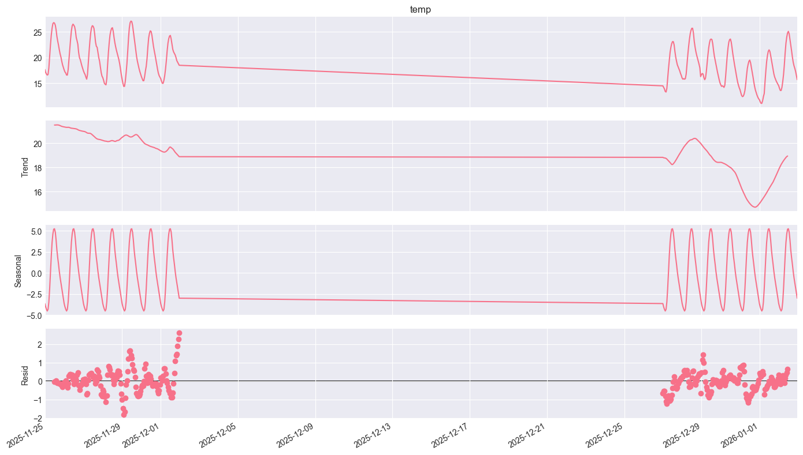
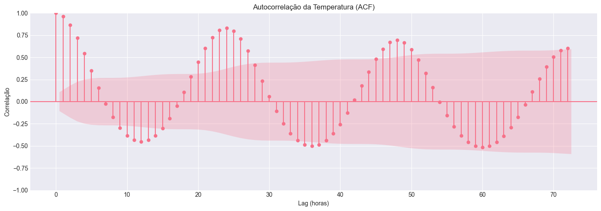
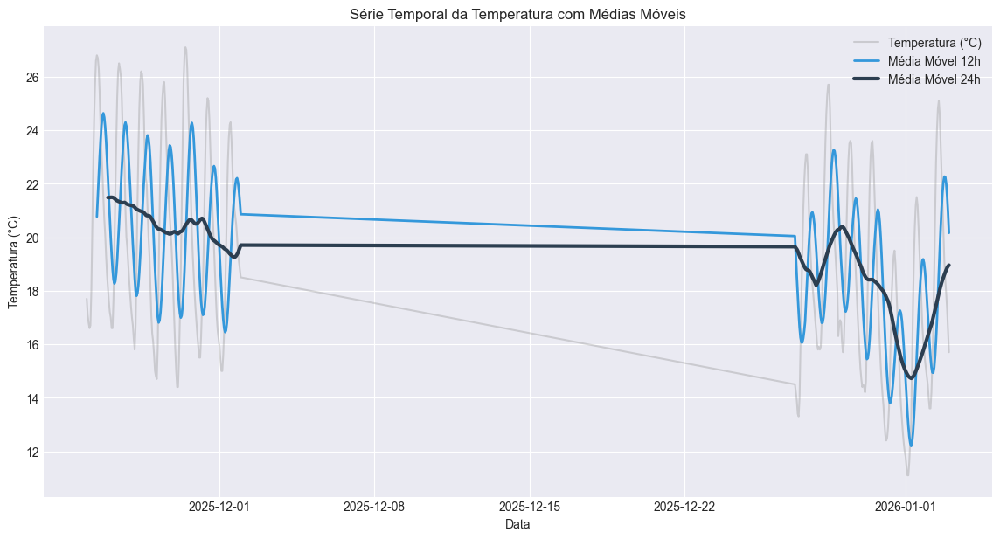
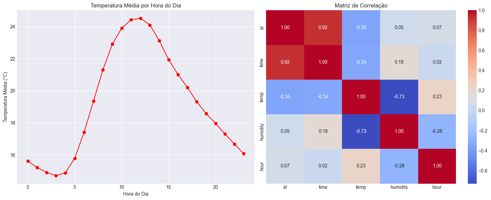

# Weather Data Pipeline

Pipeline ETL completo para coleta, transformação e armazenamento de dados climáticos com análise exploratória avançada usando Python, PostgreSQL e Docker.

> **Destaques:** UPSERT automático, features vetorizadas, análise de séries temporais com decomposição, autocorrelação (ACF) e visualizações profissionais.


## Objetivo

Demonstrar habilidades em:
- Arquitetura orientada a objetos (OOP)
- Padrões de design (Design Patterns)
- Engenharia de dados (ETL)
- Desenvolvimento CLI profissional

## Tecnologias

### Core
- **Python 3.11+** - Linguagem principal
- **Poetry** - Gerenciamento de dependências
- **Typer + Rich** - CLI moderna e output formatado

### Data & Storage
- **Pandas** - Manipulação de dados (operações 100% vetorizadas)
- **PostgreSQL 16** - Banco de dados relacional
- **Docker Compose** - Containerização do banco

### Analysis & Visualization
- **Jupyter Notebook** - Análise exploratória interativa
- **Matplotlib + Seaborn** - Visualizações profissionais
- **Statsmodels** - Análise de séries temporais (decomposição, ACF)

### Data Source
- **Open-Meteo API** - Dados climáticos em tempo real

## Instalação

### Pré-requisitos
- Python 3.11+
- Poetry
- Docker & Docker Compose

### Setup
```bash
# 1. Clone o repositório
git clone https://github.com/alojunior/weather-data-pipeline.git
cd weather-data-pipeline

# 2. Instale as dependências
poetry install

# 3. Configure variáveis de ambiente
cp .env.example .env
# Edite o .env se necessário (valores padrão funcionam para ambiente dev)

# 4. Suba o banco de dados PostgreSQL
docker-compose up -d

# 5. Verifique se o banco está rodando
docker-compose ps
```

## Como Usar

### Executar Pipeline
```bash
# CSV (padrão)
poetry run python -m datapipeline.cli pipeline --verbose

# PostgreSQL
poetry run python -m datapipeline.cli pipeline --verbose --output-format postgres

# Com debug (mostra dados brutos)
poetry run python -m datapipeline.cli pipeline --debug --verbose --output-format postgres
```

### Acessar Dados no PostgreSQL
```bash
# Conectar ao banco
docker exec -it weather_pipeline_db psql -U pipeline_user -d weather_data

# Queries úteis
SELECT COUNT(*) FROM weather_data;
SELECT * FROM weather_data ORDER BY time DESC LIMIT 5;
\q  # Sair
```

### Análise Exploratória

Abra o notebook Jupyter:
```bash
jupyter notebook notebooks/exploracao_dados.ipynb
```

## Análises e Visualizações

O projeto inclui análise exploratória completa com técnicas de séries temporais.

### Decomposição de Série Temporal

Separação dos componentes: tendência, sazonalidade e ruído.



**Insights:**
- Tendência descendente (inverno no hemisfério norte)
- Sazonalidade diária clara (ciclo de 24h)
- Resíduo baixo indica bom ajuste do modelo

---

### Autocorrelação (ACF)

Análise de correlação temporal para identificar padrões cíclicos.



**Insights:**
- Picos a cada ~24 lags confirmam periodicidade diária
- Correlação negativa a cada 12h (dia vs noite)
- Padrão persiste por 72h (3 dias)

---

### Médias Móveis

Suavização da série temporal com janelas de 12h e 24h.



**Insights:**
- Média 24h elimina completamente o ciclo diário
- Revela tendência de queda mais claramente

---

### Matriz de Correlação

Análise de relações entre variáveis climáticas.



**Insights:**
- Correlação negativa forte (-0.73) entre temperatura e umidade
- Confirma física atmosférica: ar quente "segura" mais umidade

## Arquitetura

### Pipeline ETL
```
┌─────────────────┐
│  OpenMeteoSource │  → Extração via API
└────────┬────────┘
         │
         ▼
┌─────────────────┐
│ BasicTransform   │  → 6 features vetorizadas
└────────┬────────┘
         │
         ▼
    ┌────────┐
    │  Sink  │
    └───┬┬───┘
        ││
   ┌────┘└────┐
   ▼          ▼
CSVSink   PostgresSink
           (UPSERT automático)
```

### Componentes Principais

**Core Interfaces:**
- `Source` - Contrato para extração de dados
- `Transformer` - Contrato para transformações
- `Sink` - Contrato para persistência
- `DataPipeline` - Orquestrador que conecta componentes

**Implementações:**
- `OpenMeteoSource` - Extração da API Open-Meteo
- `BasicTransform` - 6 features engineered (100% vetorizadas):
  * `temp_f` - Conversão Celsius → Fahrenheit
  * `temp_category` - Classificação (Frio/Morno/Quente)
  * `hour` - Extração de hora do dia
  * `day_of_week` - Dia da semana (0-6)
  * `is_daytime` - Indicador binário dia/noite
  * `heat_index` - Índice de sensação térmica
- `CSVSink` - Persistência em CSV
- `PostgresSink` - Persistência com UPSERT (chave: time + lat + lon)

### Padrões de Design

- **Strategy Pattern** - Interfaces abstratas permitem trocar implementações
- **Dependency Injection** - Pipeline recebe dependências via construtor
- **Configuration Object** - Centralização de configs (debug, verbose, output_format)

## Estrutura do Projeto
```
weather-data-pipeline/
├── src/
│   └── datapipeline/
│       ├── core/              # Interfaces e lógica central
│       │   ├── interfaces.py  # Contratos abstratos
│       │   ├── pipeline.py    # Orquestrador ETL
│       │   └── config.py      # Configurações
│       ├── sources/           # Extração de dados
│       │   └── open_meteo.py
│       ├── processing/        # Transformações
│       │   └── basic_transform.py
│       └── storage/           # Persistência
│           ├── csv_sink.py
│           └── postgres_sink.py
├── notebooks/                 # Análises exploratórias
│   └── exploracao_dados.ipynb
├── docs/                      # Documentação e imagens
│   └── Images/
├── output/                    # Dados processados (CSV)
├── docker-compose.yml         # Configuração PostgreSQL
├── .env.example              # Template de variáveis
├── pyproject.toml            # Dependências
└── README.md
```

## Roadmap

### Concluído 

- [x] Pipeline ETL básico com CSV
- [x] CLI profissional com Typer
- [x] Logging (debug/verbose)
- [x] PostgreSQL com UPSERT automático
- [x] Docker + Docker Compose
- [x] Variáveis de ambiente (.env)
- [x] 6 features vetorizadas no transform
- [x] Análise exploratória avançada (decomposição, ACF, médias móveis)
- [x] Notebook Jupyter com visualizações profissionais

### Próximos Passos 

- [ ] Testes automatizados (pytest)
- [ ] CI/CD com GitHub Actions
- [ ] Suporte a múltiplas localizações simultâneas
- [ ] Dashboard interativo (Streamlit ou Plotly Dash)
- [ ] Modelagem preditiva (ARIMA/SARIMA)

## Nota sobre Segurança

As credenciais no `docker-compose.yml` são para **ambiente de desenvolvimento local** apenas. 

Em produção, utilize:
- Variáveis de ambiente do servidor
- Secrets managers (AWS Secrets Manager, HashiCorp Vault)
- Nunca commite credenciais reais no repositório

## Licença

MIT

## Autor

**André Luis de Oliveira Junior**
- LinkedIn: [linkedin.com/in/alojunior](https://linkedin.com/in/alojunior)
- GitHub: [github.com/alojunior](https://github.com/alojunior)